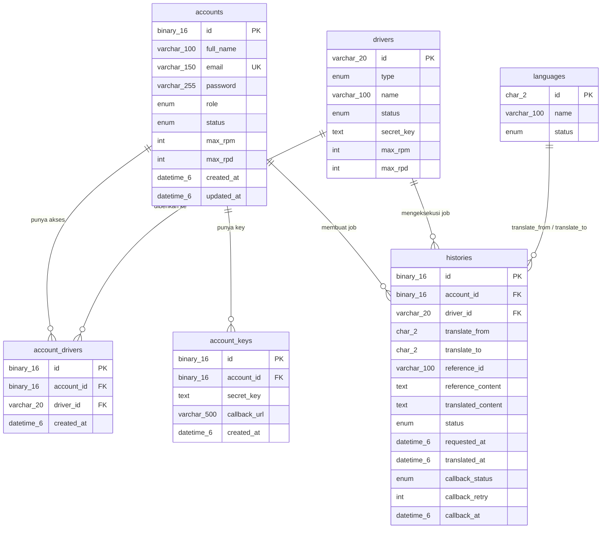

# Dokumentasi Skema Database

Database: **MySQL 8.x** · Engine: **InnoDB** · Charset: **utf8mb4 / utf8mb4_unicode_ci**
Nama database default: **`mdi_translator`** (bisa diubah lewat `DB_DATABASE`).

Dokumen ini menjelaskan struktur tabel, konvensi penyimpanan, relasi, index, dan
query yang dipakai aplikasi. Sumber kebenaran schema adalah migration di
`src/database/migrations/` — kolom **tidak pernah** diubah lewat `synchronize`
(`DB_SYNCHRONIZE=false`).

Dokumentasi API ada di [README.md](./README.md).

---

## Daftar Isi

1. [Ringkasan Tabel](#1-ringkasan-tabel)
2. [Diagram Relasi](#2-diagram-relasi)
3. [Konvensi Penyimpanan](#3-konvensi-penyimpanan)
4. [Detail Tabel](#4-detail-tabel)
5. [Relasi & Integritas Data](#5-relasi--integritas-data)
6. [Index & Pertimbangan Performa](#6-index--pertimbangan-performa)
7. [DDL Lengkap](#7-ddl-lengkap)
8. [Migration](#8-migration)
9. [Seeder](#9-seeder)
10. [Query Referensi](#10-query-referensi)
11. [Operasional & Maintenance](#11-operasional--maintenance)
12. [Checklist Perubahan Skema](#12-checklist-perubahan-skema)

---

## 1. Ringkasan Tabel

| Tabel                | Fungsi                                                      | PK               | Baris bertambah saat                    |
| -------------------- | ----------------------------------------------------------- | ---------------- | --------------------------------------- |
| `languages`          | Master bahasa yang didukung                                 | `id` char(2)     | admin menambah bahasa                   |
| `drivers`            | Master driver penerjemah + kredensial provider              | `id` varchar(20) | admin menambah driver                   |
| `accounts`           | Akun `admin` / `client` beserta quota                       | `id` binary(16)  | akun dibuat (API/seeder)                |
| `account_drivers`    | Driver mana yang boleh dipakai sebuah akun                  | `id` binary(16)  | admin memberi akses driver              |
| `account_keys`       | Kredensial API (`key_id` + `secret_key`) dan `callback_url` | `id` binary(16)  | akun membuat key                        |
| `histories`          | Setiap job terjemahan beserta hasil & status callback       | `id` binary(16)  | `POST /translate` (1 baris per request) |
| `typeorm_migrations` | Buku catatan migration TypeORM (internal)                   | `id` int         | `npm run migration:run`                 |

Volume data yang perlu diperhatikan hanya `histories` — tabel lain bersifat master
data (jumlah baris kecil). Strategi retensi ada di [bagian 11](#11-operasional--maintenance).

---

## 2. Diagram Relasi



> `histories.translate_from` / `translate_to` merujuk ke `languages.id` secara
> **logis** (divalidasi aplikasi saat `POST /translate`), bukan lewat foreign key,
> supaya riwayat translasi tidak ikut terhapus/diblokir ketika master bahasa diubah.

---

## 3. Konvensi Penyimpanan

### 3.1 Identifier UUIDv7 → `binary(16)`

Semua id berjenis UUID (`accounts`, `account_drivers`, `account_keys`, `histories`)
disimpan sebagai **`binary(16)`** berisi 16 byte canonical UUIDv7 — bukan char(36).
Keuntungan: index lebih kecil (16 byte vs 36 byte) dan karena UUIDv7 berawalan
timestamp miliknya urut secara kronologis sehingga ramah untuk B-tree.

- Aplikasi memakai transformer `uuidBinaryTransformer` (`src/common/utils/uuid.util.ts`):
  string UUID ⇄ `Buffer` 16 byte, transparan di level entity/repository.
- Di SQL, konversi bisa memakai `UUID_TO_BIN()` / `BIN_TO_UUID()` **tanpa** argumen
  `swap_flag`:

  ```sql
  SELECT BIN_TO_UUID(id) AS id, email FROM accounts;         -- binary -> teks
  WHERE id = UUID_TO_BIN('01a0eea2-221c-70cd-83d0-56e95a65c37b')
  ```

  ⚠️ **Jangan** memakai `UUID_TO_BIN(x, 1)` / `BIN_TO_UUID(x, 1)`. Flag `1` menukar
  urutan byte time-field yang hanya benar untuk UUIDv1, sehingga UUIDv7 akan rusak
  (contoh hasilnya: `221c70cd-eea2-01a0-…`).

- Alternatif tanpa fungsi MySQL 8: `UNHEX(REPLACE('uuid-teks', '-', ''))` untuk
  menulis dan `LOWER(HEX(id))` untuk membaca (32 karakter hex tanpa tanda hubung).

### 3.2 Waktu: `datetime(6)` dalam UTC

Seluruh kolom waktu memakai **`datetime(6)`** (presisi mikrodetik) dan berisi
**UTC**, ditulis oleh aplikasi (koneksi MySQL memakai `timezone: 'Z'`).

`DATETIME` bersifat _time zone agnostic_: nilai yang dikirim driver disimpan
apa adanya, sehingga tidak terpengaruh `time_zone` session MySQL dan hasilnya sama
baik dibaca dari API, dari client SQL, maupun dari tools reporting.

- Aplikasi **selalu** mengirim nilai waktu secara eksplisit (`new Date()`), termasuk
  `accounts.updated_at` (lihat [bagian 4.3](#43-accounts)).
- Kolom `created_at` / `requested_at` tetap punya `DEFAULT CURRENT_TIMESTAMP(6)`
  hanya sebagai jaring pengaman bila ada yang menulis manual — nilai default
  tersebut mengikuti **time zone server**, jadi saat menulis manual sebaiknya
  isi kolom waktunya secara eksplisit, mis. `UTC_TIMESTAMP(6)`.

Cek cepat zona waktu server dan isi kolom:

```sql
SELECT @@global.time_zone, @@session.time_zone, NOW(6), UTC_TIMESTAMP(6);
SELECT id, requested_at, translated_at FROM histories ORDER BY requested_at DESC LIMIT 5;
```

### 3.3 Secret terenkripsi

`drivers.secret_key` dan `account_keys.secret_key` menyimpan nilai **terenkripsi**
(AES-256-GCM), bukan teks asli. Format payload:

```
v1.<iv base64url>.<authTag base64url>.<cipherText base64url>
```

- Kunci enkripsi = `sha256(APP_ENCRYPTION_KEY)` → 32 byte untuk AES-256.
- `APP_ENCRYPTION_KEY` **harus sama** di semua instance API/worker. Menggantinya
  membuat secret lama tidak bisa didekripsi (perlu re-enkripsi, lihat bagian 11.4).
- Nilai bisa `NULL` → driver/key belum dikonfigurasi. `POST /translate` menolak job
  dengan driver tanpa `secret_key` (HTTP 503).
- Kolom ini bertipe `TEXT` (bukan varchar pendek) agar cukup untuk kredensial
  panjang seperti service-account JSON Google.

`accounts.password` menyimpan **hash bcrypt** (cost = `BCRYPT_ROUNDS`, default 10),
tidak pernah dikembalikan API.

### 3.4 Enum & nilai khusus

| Kolom                                                   | Nilai yang sah                      |
| ------------------------------------------------------- | ----------------------------------- |
| `languages.status`, `drivers.status`, `accounts.status` | `active`, `inactive`                |
| `drivers.type`                                          | `ai`, `api`                         |
| `accounts.role`                                         | `admin`, `client`                   |
| `histories.status`                                      | `requested`, `translated`, `failed` |
| `histories.callback_status`                             | `open`, `close`                     |

`max_rpm` / `max_rpd` (di `accounts` dan `drivers`): **`0` = tanpa batas**.

### 3.5 Penamaan

- Kolom: `snake_case`; primary key selalu `id`; foreign key `<tabel_tunggal>_id`.
- Index: `idx_<tabel>_<kolom…>` untuk index biasa, `uq_<tabel>_<kolom…>` untuk unique.
- Foreign key: `fk_<tabel>_<referensi>`.
- Charset tabel aplikasi: `utf8mb4` / `utf8mb4_unicode_ci` (mendukung emoji & aksara
  non-Latin). Tabel `typeorm_migrations` memakai default TypeORM
  (`utf8mb4_general_ci`) dan tidak perlu diubah.

---

## 4. Detail Tabel

### 4.1 `languages`

Master data bahasa yang bisa dipilih sebagai `translate_from` / `translate_to`.

| Kolom    | Tipe           | Null | Default  | Keterangan                                      |
| -------- | -------------- | ---- | -------- | ----------------------------------------------- |
| `id`     | `char(2)`      | NO   | –        | Kode bahasa ISO 639-1, huruf kecil (`id`, `en`) |
| `name`   | `varchar(100)` | NO   | –        | Nama bahasa (`Bahasa Indonesia`)                |
| `status` | `enum`         | NO   | `active` | `active` / `inactive`                           |

- **PK**: `id`
- Bahasa `inactive` ditolak saat `POST /translate` (`400 Language "xx" is inactive`).
- Tidak ada kolom waktu (master data statis mengikuti rancangan awal).

```json
{ "id": "en", "name": "English", "status": "active" }
```

### 4.2 `drivers`

Master data driver penerjemah. Prefix `id` menentukan engine yang dipakai
(lihat README bagian 13).

| Kolom        | Tipe           | Null | Default  | Keterangan                                                 |
| ------------ | -------------- | ---- | -------- | ---------------------------------------------------------- |
| `id`         | `varchar(20)`  | NO   | –        | Id driver, mis. `gemini-3.8-flash`, `api-google-translate` |
| `type`       | `enum`         | NO   | –        | `ai` (LLM) / `api` (API translasi khusus)                  |
| `name`       | `varchar(100)` | NO   | –        | Nama tampilan                                              |
| `status`     | `enum`         | NO   | `active` | `active` / `inactive`                                      |
| `secret_key` | `text`         | YES  | `NULL`   | Kredensial provider, **terenkripsi**                       |
| `max_rpm`    | `int`          | NO   | `0`      | Maksimal task per menit (`0` = tanpa batas)                |
| `max_rpd`    | `int`          | NO   | `0`      | Maksimal task per hari (`0` = tanpa batas)                 |

- **PK**: `id`
- Quota dihitung dari jumlah baris `histories` dengan `driver_id` tersebut, bukan
  dari jumlah panggilan sukses — lihat [bagian 4.6](#46-histories) dan README bagian 12.
- Driver sudah dipakai pada `histories` **tidak bisa dihapus** (FK `ON DELETE RESTRICT`);
  nonaktifkan saja (`status = 'inactive'`) untuk mempertahankan riwayat.

### 4.3 `accounts`

Akun `admin` (mengelola master data) dan `client` (memakai API translation).

| Kolom        | Tipe           | Null | Default                | Keterangan                                       |
| ------------ | -------------- | ---- | ---------------------- | ------------------------------------------------ |
| `id`         | `binary(16)`   | NO   | –                      | UUIDv7 (PK)                                      |
| `full_name`  | `varchar(100)` | NO   | –                      | Nama lengkap                                     |
| `email`      | `varchar(150)` | NO   | –                      | Unik (`uq_accounts_email`), lowercase            |
| `password`   | `varchar(255)` | NO   | –                      | Hash bcrypt (cost `BCRYPT_ROUNDS`)               |
| `role`       | `enum`         | NO   | `client`               | `admin` / `client`                               |
| `status`     | `enum`         | NO   | `active`               | Akun `inactive` tidak bisa login / memanggil API |
| `max_rpm`    | `int`          | NO   | `0`                    | Batas request API per menit                      |
| `max_rpd`    | `int`          | NO   | `0`                    | Batas request API per hari                       |
| `created_at` | `datetime(6)`  | NO   | `CURRENT_TIMESTAMP(6)` | UTC, ditulis aplikasi saat insert                |
| `updated_at` | `datetime(6)`  | NO   | `CURRENT_TIMESTAMP(6)` | UTC, ditulis aplikasi setiap update              |

- **PK**: `id` · **Unique**: `email`
- `updated_at` **tidak** memakai `ON UPDATE CURRENT_TIMESTAMP(6)` — nilainya
  diisi eksplisit oleh `AccountsService.update()` supaya konsisten UTC
  (lihat komentar di migration `1780280000000-StoreTimestampsAsUtcDateTime`).
- Menghapus akun menghapus turunannya (lihat bagian 5).

### 4.4 `account_drivers`

Tabel pivot: driver mana yang boleh dipakai oleh sebuah akun.

| Kolom        | Tipe          | Null | Default                | Keterangan         |
| ------------ | ------------- | ---- | ---------------------- | ------------------ |
| `id`         | `binary(16)`  | NO   | –                      | UUIDv7 (PK)        |
| `account_id` | `binary(16)`  | NO   | –                      | FK → `accounts.id` |
| `driver_id`  | `varchar(20)` | NO   | –                      | FK → `drivers.id`  |
| `created_at` | `datetime(6)` | NO   | `CURRENT_TIMESTAMP(6)` | UTC                |

- **PK**: `id`
- **Unique**: `uq_account_drivers_account_driver` (`account_id`, `driver_id`) →
  satu pasangan akun+driver hanya boleh tercatat sekali.
- **Index**: `idx_account_drivers_driver_id` (untuk daftar akun per driver).
- Dipakai `TranslateService` sebagai penjaga akses: driver yang tidak terdaftar
  di sini ditolak `403`.
- `GET /drivers` untuk role `client` difilter dari tabel ini.

### 4.5 `account_keys`

Kredensial API milik akun. `id` inilah yang dikirim sebagai header `key_id`, dan
`secret_key` dipakai untuk menandatangani/verifikasi JWT pada `/translate`
maupun callback.

| Kolom          | Tipe           | Null | Default                | Keterangan                                            |
| -------------- | -------------- | ---- | ---------------------- | ----------------------------------------------------- |
| `id`           | `binary(16)`   | NO   | –                      | UUIDv7 (PK) — nilai header `key_id`                   |
| `account_id`   | `binary(16)`   | NO   | –                      | FK → `accounts.id`                                    |
| `secret_key`   | `text`         | YES  | `NULL`                 | Secret (terenkripsi); dipakai sebagai kunci HMAC      |
| `callback_url` | `varchar(500)` | YES  | `NULL`                 | Tujuan callback; `NULL` = client polling `/histories` |
| `created_at`   | `datetime(6)`  | NO   | `CURRENT_TIMESTAMP(6)` | UTC                                                   |

- **PK**: `id` · **Index**: `idx_account_keys_account_id`
- Satu akun boleh punya banyak key (mis. per aplikasi/integrasi). Saat
  `keyId` pada pesan queue sudah tidak ada, worker callback memakai key **tertua**
  milik akun tersebut sebagai fallback.
- `callback_url` kosong → worker menutup callback (`callback_status = 'close'`)
  dan hasilnya hanya bisa diambil lewat `GET /histories`.

### 4.6 `histories`

Satu baris = satu job terjemahan, dari request sampai callback. Ini tabel dengan
pertumbuhan terbesar dan sumber semua perhitungan quota.

| Kolom                | Tipe           | Null | Default                | Keterangan                                                |
| -------------------- | -------------- | ---- | ---------------------- | --------------------------------------------------------- |
| `id`                 | `binary(16)`   | NO   | –                      | UUIDv7 (PK), dikembalikan sebagai `history_id`            |
| `account_id`         | `binary(16)`   | NO   | –                      | FK → `accounts.id` (pemilik job)                          |
| `driver_id`          | `varchar(20)`  | NO   | –                      | FK → `drivers.id` (RESTRICT)                              |
| `translate_from`     | `char(2)`      | NO   | –                      | Kode bahasa sumber                                        |
| `translate_to`       | `char(2)`      | NO   | –                      | Kode bahasa tujuan                                        |
| `reference_id`       | `varchar(100)` | NO   | –                      | Id milik client, di-echo ke callback                      |
| `reference_content`  | `text`         | NO   | –                      | Konten asli                                               |
| `translated_content` | `text`         | YES  | `NULL`                 | Hasil terjemahan (`NULL` bila gagal/belum selesai)        |
| `status`             | `enum`         | NO   | `requested`            | `requested` → `translated` / `failed`                     |
| `requested_at`       | `datetime(6)`  | NO   | `CURRENT_TIMESTAMP(6)` | UTC, waktu request diterima                               |
| `translated_at`      | `datetime(6)`  | YES  | `NULL`                 | UTC, waktu proses selesai (apa pun hasilnya)              |
| `callback_status`    | `enum`         | NO   | `open`                 | `open` = masih akan dikirim, `close` = selesai/diabaikan  |
| `callback_retry`     | `int`          | NO   | `0`                    | Jumlah percobaan pengiriman callback yang sudah dilakukan |
| `callback_at`        | `datetime(6)`  | YES  | `NULL`                 | UTC, terisi hanya bila callback **berhasil**              |

Dipakai juga oleh `RateLimitService`:

```sql
-- quota akun ini dalam 60 detik terakhir dan sejak 00:00 UTC
SELECT SUM(requested_at >= UTC_TIMESTAMP(6) - INTERVAL 60 SECOND) AS rpm,
       SUM(requested_at >= UTC_DATE())                       AS rpd
FROM histories
WHERE account_id = UUID_TO_BIN('01a0eea2-221c-70cd-83d0-56e95a65c37b');
```

Catatan semantik:

- `0` = unlimited pada `max_rpm`/`max_rpd` (di `accounts` / `drivers`).
- Baris `requested` ikut dihitung dalam quota, karena job sudah memakai “slot”
  walau belum diproses.
- `callback_retry` = jumlah percobaan yang **sudah** dilakukan. Nilai `2` dengan
  `callback_status = 'close'` berarti callback gagal 2x lalu diabaikan
  (`callback_at` tetap `NULL`).
- Job dengan `translate_from = translate_to` langsung `translated` tanpa memanggil
  provider (isi `translated_content` = `reference_content`).

---

## 5. Relasi & Integritas Data

| Foreign key                  | Dari                         | Ke            | ON DELETE | Konsekuensi                                    |
| ---------------------------- | ---------------------------- | ------------- | --------- | ---------------------------------------------- |
| `fk_account_drivers_account` | `account_drivers.account_id` | `accounts.id` | CASCADE   | akun dihapus → akses driver ikut terhapus      |
| `fk_account_drivers_driver`  | `account_drivers.driver_id`  | `drivers.id`  | CASCADE   | driver dihapus → akses ikut terhapus           |
| `fk_account_keys_account`    | `account_keys.account_id`    | `accounts.id` | CASCADE   | akun dihapus → key ikut terhapus               |
| `fk_histories_account`       | `histories.account_id`       | `accounts.id` | CASCADE   | akun dihapus → riwayat translasi ikut terhapus |
| `fk_histories_driver`        | `histories.driver_id`        | `drivers.id`  | RESTRICT  | driver yang sudah dipakai tidak bisa dihapus   |

Semua FK memakai `ON UPDATE CASCADE` (tidak relevan dalam praktik karena id tidak
pernah diubah).

> ⚠️ Menghapus akun (`DELETE /accounts/delete/{ID}`) **menghapus seluruh riwayat
> translasi akun tersebut**. Untuk menghentikan pemakaian, lebih aman mengubah
> `status` menjadi `inactive`.

Relasi logis (tanpa FK):

- `histories.translate_from` / `translate_to` → `languages.id` (divalidasi aplikasi).
- `histories.id` dapat dipakai sebagai acuan `history_id` pada response API.

---

## 6. Index & Pertimbangan Performa

| Index                                | Kolom                        | Melayani query                                                                  |
| ------------------------------------ | ---------------------------- | ------------------------------------------------------------------------------- |
| `PRIMARY`                            | `histories.id`               | lookup detail (`/histories/detail/{ID}`), update status dari worker             |
| `idx_histories_account_requested_at` | `account_id`, `requested_at` | daftar history per akun (client) dengan urutan terbaru + perhitungan quota akun |
| `idx_histories_driver_requested_at`  | `driver_id`, `requested_at`  | perhitungan quota driver (`max_rpm` / `max_rpd`) di worker                      |
| `idx_histories_status`               | `status`                     | filter `status`, pencarian job yang tersangkut (`requested`)                    |
| `idx_histories_reference_id`         | `reference_id`               | pencarian job milik client berdasarkan id mereka                                |
| `uq_accounts_email`                  | `email`                      | login + pencegahan duplikat                                                     |
| `uq_account_drivers_account_driver`  | `account_id`, `driver_id`    | penjaga akses driver + anti duplikat                                            |
| `idx_account_keys_account_id`        | `account_id`                 | daftar key per akun (scope client)                                              |
| `idx_account_drivers_driver_id`      | `driver_id`                  | daftar akun per driver (admin)                                                  |

Catatan:

- Kolom `text` (`reference_content`, `translated_content`, `secret_key`) disimpan
  off-page oleh InnoDB, jadi tidak membesarkan baris utama; namun `SELECT *` pada
  `histories` tetap membawa konten penuh. Untuk listing, pilih kolom yang perlu.
- `reference_content` / `translated_content` hanya dibaca untuk detail dan callback.
- Pencarian `search` pada `/histories` memakai `LIKE '%…%'` sehingga tidak bisa
  memakai index — batasi dengan filter lain (`account_id`, `date_from`/`date_to`,
  `reference_id`) agar tetap cepat saat data besar. Untuk kebutuhan pencarian teks
  serius, pertimbangkan FULLTEXT index atau tabel pencarian terpisah.
- Ukuran `histories` tumbuh ±1 baris per request translation; lihat retensi di
  [bagian 11.3](#113-retensi-data-histories).

---

## 7. DDL Lengkap

Hasil `SHOW CREATE TABLE` (MySQL 8) untuk seluruh tabel:

```sql
CREATE TABLE `languages` (
  `id` char(2) COLLATE utf8mb4_unicode_ci NOT NULL,
  `name` varchar(100) COLLATE utf8mb4_unicode_ci NOT NULL,
  `status` enum('active','inactive') COLLATE utf8mb4_unicode_ci NOT NULL DEFAULT 'active',
  PRIMARY KEY (`id`)
) ENGINE=InnoDB DEFAULT CHARSET=utf8mb4 COLLATE=utf8mb4_unicode_ci;

CREATE TABLE `drivers` (
  `id` varchar(20) COLLATE utf8mb4_unicode_ci NOT NULL,
  `type` enum('ai','api') COLLATE utf8mb4_unicode_ci NOT NULL,
  `name` varchar(100) COLLATE utf8mb4_unicode_ci NOT NULL,
  `status` enum('active','inactive') COLLATE utf8mb4_unicode_ci NOT NULL DEFAULT 'active',
  `secret_key` text COLLATE utf8mb4_unicode_ci,
  `max_rpm` int NOT NULL DEFAULT '0',
  `max_rpd` int NOT NULL DEFAULT '0',
  PRIMARY KEY (`id`)
) ENGINE=InnoDB DEFAULT CHARSET=utf8mb4 COLLATE=utf8mb4_unicode_ci;

CREATE TABLE `accounts` (
  `id` binary(16) NOT NULL,
  `full_name` varchar(100) COLLATE utf8mb4_unicode_ci NOT NULL,
  `email` varchar(150) COLLATE utf8mb4_unicode_ci NOT NULL,
  `password` varchar(255) COLLATE utf8mb4_unicode_ci NOT NULL,
  `role` enum('admin','client') COLLATE utf8mb4_unicode_ci NOT NULL DEFAULT 'client',
  `status` enum('active','inactive') COLLATE utf8mb4_unicode_ci NOT NULL DEFAULT 'active',
  `max_rpm` int NOT NULL DEFAULT '0',
  `max_rpd` int NOT NULL DEFAULT '0',
  `created_at` datetime(6) NOT NULL DEFAULT CURRENT_TIMESTAMP(6),
  `updated_at` datetime(6) NOT NULL DEFAULT CURRENT_TIMESTAMP(6),
  PRIMARY KEY (`id`),
  UNIQUE KEY `uq_accounts_email` (`email`)
) ENGINE=InnoDB DEFAULT CHARSET=utf8mb4 COLLATE=utf8mb4_unicode_ci;

CREATE TABLE `account_drivers` (
  `id` binary(16) NOT NULL,
  `account_id` binary(16) NOT NULL,
  `driver_id` varchar(20) COLLATE utf8mb4_unicode_ci NOT NULL,
  `created_at` datetime(6) NOT NULL DEFAULT CURRENT_TIMESTAMP(6),
  PRIMARY KEY (`id`),
  UNIQUE KEY `uq_account_drivers_account_driver` (`account_id`,`driver_id`),
  KEY `idx_account_drivers_driver_id` (`driver_id`),
  CONSTRAINT `fk_account_drivers_account` FOREIGN KEY (`account_id`) REFERENCES `accounts` (`id`) ON DELETE CASCADE ON UPDATE CASCADE,
  CONSTRAINT `fk_account_drivers_driver` FOREIGN KEY (`driver_id`) REFERENCES `drivers` (`id`) ON DELETE CASCADE ON UPDATE CASCADE
) ENGINE=InnoDB DEFAULT CHARSET=utf8mb4 COLLATE=utf8mb4_unicode_ci;

CREATE TABLE `account_keys` (
  `id` binary(16) NOT NULL,
  `account_id` binary(16) NOT NULL,
  `secret_key` text COLLATE utf8mb4_unicode_ci,
  `callback_url` varchar(500) COLLATE utf8mb4_unicode_ci DEFAULT NULL,
  `created_at` datetime(6) NOT NULL DEFAULT CURRENT_TIMESTAMP(6),
  PRIMARY KEY (`id`),
  KEY `idx_account_keys_account_id` (`account_id`),
  CONSTRAINT `fk_account_keys_account` FOREIGN KEY (`account_id`) REFERENCES `accounts` (`id`) ON DELETE CASCADE ON UPDATE CASCADE
) ENGINE=InnoDB DEFAULT CHARSET=utf8mb4 COLLATE=utf8mb4_unicode_ci;

CREATE TABLE `histories` (
  `id` binary(16) NOT NULL,
  `account_id` binary(16) NOT NULL,
  `driver_id` varchar(20) COLLATE utf8mb4_unicode_ci NOT NULL,
  `translate_from` char(2) COLLATE utf8mb4_unicode_ci NOT NULL,
  `translate_to` char(2) COLLATE utf8mb4_unicode_ci NOT NULL,
  `reference_id` varchar(100) COLLATE utf8mb4_unicode_ci NOT NULL,
  `reference_content` text COLLATE utf8mb4_unicode_ci NOT NULL,
  `translated_content` text COLLATE utf8mb4_unicode_ci,
  `status` enum('requested','translated','failed') COLLATE utf8mb4_unicode_ci NOT NULL DEFAULT 'requested',
  `requested_at` datetime(6) NOT NULL DEFAULT CURRENT_TIMESTAMP(6),
  `translated_at` datetime(6) DEFAULT NULL,
  `callback_status` enum('open','close') COLLATE utf8mb4_unicode_ci NOT NULL DEFAULT 'open',
  `callback_retry` int NOT NULL DEFAULT '0',
  `callback_at` datetime(6) DEFAULT NULL,
  PRIMARY KEY (`id`),
  KEY `idx_histories_account_requested_at` (`account_id`,`requested_at`),
  KEY `idx_histories_driver_requested_at` (`driver_id`,`requested_at`),
  KEY `idx_histories_status` (`status`),
  KEY `idx_histories_reference_id` (`reference_id`),
  CONSTRAINT `fk_histories_account` FOREIGN KEY (`account_id`) REFERENCES `accounts` (`id`) ON DELETE CASCADE ON UPDATE CASCADE,
  CONSTRAINT `fk_histories_driver` FOREIGN KEY (`driver_id`) REFERENCES `drivers` (`id`) ON DELETE RESTRICT ON UPDATE CASCADE
) ENGINE=InnoDB DEFAULT CHARSET=utf8mb4 COLLATE=utf8mb4_unicode_ci;

-- internal TypeORM bookkeeping
CREATE TABLE `typeorm_migrations` (
  `id` int NOT NULL AUTO_INCREMENT,
  `timestamp` bigint NOT NULL,
  `name` varchar(255) COLLATE utf8mb4_general_ci NOT NULL,
  PRIMARY KEY (`id`)
) ENGINE=InnoDB DEFAULT CHARSET=utf8mb4 COLLATE=utf8mb4_general_ci;
```

---

## 8. Migration

Schema dikelola TypeORM migration (`src/database/data-source.ts` untuk CLI) dan
memakai tabel `typeorm_migrations` sebagai catatan versi.

| Migration                                    | Isi                                                                                                                                  |
| -------------------------------------------- | ------------------------------------------------------------------------------------------------------------------------------------ |
| `1780272000000-InitialSchema`                | membuat 6 tabel aplikasi beserta index dan foreign key                                                                               |
| `1780280000000-StoreTimestampsAsUtcDateTime` | mengubah semua kolom waktu dari `timestamp(6)` ke `datetime(6)` dan melepas `ON UPDATE CURRENT_TIMESTAMP` pada `accounts.updated_at` |

```bash
npm run db:create                                     # buat database bila belum ada
npm run migration:run                                 # terapkan semua migration
npm run migration:show                                # status
npm run migration:revert                              # batalkan migration terakhir
npm run migration:generate -- src/database/migrations/NamaMigration   # dari perubahan entity
```

Catatan saat membuat migration baru:

- `DB_SYNCHRONIZE` tetap `false`; jangan mengandalkan auto-sync.
- Tulis migration secara eksplisit (SQL/QueryRunner) agar perubahan aman untuk data
  yang sudah ada, mis. `ALTER TABLE … MODIFY …` untuk mengubah tipe kolom.
- Setelah menambah/mengubah kolom, sinkronkan juga entity TypeORM di
  `src/modules/**/entities/` (nama kolom snake_case ditulis eksplisit via `name:`).

---

## 9. Seeder

`npm run seed` bersifat **idempotent** (aman diulang) dan mengisi data awal:

| Tabel             | Data                                                                                                                                                                                                                     |
| ----------------- | ------------------------------------------------------------------------------------------------------------------------------------------------------------------------------------------------------------------------ |
| `languages`       | `id` = Bahasa Indonesia, `en` = English                                                                                                                                                                                  |
| `drivers`         | `gemini-3.8-flash` (type `ai`, status `active`, `max_rpm` 10 / `max_rpd` 250, **`secret_key` NULL**) dan `api-google-translate` (type `api`, status `inactive`, `max_rpm` 100 / `max_rpd` 10.000, **`secret_key` NULL**) |
| `accounts`        | Admin `halo.trisnasejati@gmail.com` / `admin123` (role `admin`) dan Client `devs.trisnasejati@gmail.com` / `client123` (role `client`), keduanya quota `0` (tanpa batas)                                                 |
| `account_drivers` | kedua driver diberikan ke kedua akun                                                                                                                                                                                     |
| `account_keys`    | 1 key per akun, `callback_url` = `http://localhost:4000/callback`, `secret_key` acak `sk_translator_<48 hex>`                                                                                                            |

> **Isi `secret_key` sebelum memakai driver.** Seeder tidak menyertakan kredensial
> provider, sehingga request pertama akan ditolak `503 Driver "…" is not configured yet`
> sampai admin mengisi key lewat `PUT /drivers/update/{ID}` (atau membuat driver baru
> dengan `POST /drivers/insert`).
>
> `key_id` dan `secret_key` akun hanya dicetak sekali oleh seeder — simpan segera,
> karena `account_keys.secret_key` disimpan terenkripsi dan tidak bisa dibaca lagi
> dari API.

Password disimpan sebagai hash bcrypt, jadi nilai di atas hanya berlaku pada
database yang baru di-seed (password akun yang diubah lewat API tidak kembali ke nilai awal).

---

## 10. Query Referensi

Semua contoh memakai UUIDv7 textual + `UUID_TO_BIN()` (tanpa swap flag).

**Daftar history terbaru milik satu akun (dengan pagination):**

```sql
SELECT BIN_TO_UUID(id) AS id, reference_id, translate_from, translate_to,
       status, callback_status, callback_retry, requested_at, translated_at
FROM histories
WHERE account_id = UUID_TO_BIN('01a0eea2-221c-70cd-83d0-56e95a65c37b')
ORDER BY requested_at DESC
LIMIT 10 OFFSET 0;
```

**Job yang lama tidak selesai (indikasi worker / provider bermasalah):**

```sql
SELECT BIN_TO_UUID(id) AS id, account_id, driver_id, requested_at,
       TIMESTAMPDIFF(MINUTE, requested_at, UTC_TIMESTAMP(6)) AS minutes_waiting
FROM histories
WHERE status = 'requested'
  AND requested_at < UTC_TIMESTAMP(6) - INTERVAL 10 MINUTE
ORDER BY requested_at ASC;
```

**Callback yang masih terbuka (menunggu pengiriman ulang):**

```sql
SELECT BIN_TO_UUID(id) AS id, reference_id, callback_status, callback_retry, translated_at
FROM histories
WHERE callback_status = 'open' AND status <> 'requested'
ORDER BY requested_at DESC;
```

**Pemakaian quota per akun hari ini:**

```sql
SELECT BIN_TO_UUID(account_id) AS account_id, COUNT(*) AS total,
       SUM(status = 'translated') AS sukses,
       SUM(status = 'failed')     AS gagal
FROM histories
WHERE requested_at >= UTC_DATE()
GROUP BY account_id
ORDER BY total DESC;
```

**Pemakaian per driver hari ini (bandingkan dengan `drivers.max_rpd`):**

```sql
SELECT h.driver_id, d.name, COUNT(*) AS total_hari_ini, d.max_rpd,
       ROUND(COUNT(*) / NULLIF(d.max_rpd, 0) * 100, 1) AS persen_quota
FROM histories h
JOIN drivers d ON d.id = h.driver_id
WHERE h.requested_at >= UTC_DATE()
GROUP BY h.driver_id, d.name, d.max_rpd
ORDER BY total_hari_ini DESC;
```

**Melihat baris akun/key beserta status kredensial (secret tidak didekripsi di SQL):**

```sql
SELECT BIN_TO_UUID(id) AS id, full_name, email, role, status,
       (password IS NOT NULL) AS punya_password
FROM accounts;

SELECT BIN_TO_UUID(k.id) AS key_id, a.email, k.callback_url,
       (k.secret_key IS NOT NULL) AS punya_secret, k.created_at
FROM account_keys k
JOIN accounts a ON a.id = k.account_id;
```

---

## 11. Operasional & Maintenance

### 11.1 Backup & restore

```bash
# struktur + data
mysqldump -u root -p --single-transaction --routines --triggers mdi_translator > backup.sql

# hanya struktur (untuk audit schema)
mysqldump -u root -p --no-data --skip-comments mdi_translator > schema.sql

mysql -u root -p mdi_translator < backup.sql
```

`--single-transaction` memberi snapshot konsisten untuk InnoDB tanpa mengunci tabel.
Backup berisi `secret_key` **terenkripsi**; tanpa `APP_ENCRYPTION_KEY` yang sesuai
nilainya tidak bisa dipakai.

### 11.2 Melihat isi tabel dengan cepat

```sql
SHOW TABLES;
SHOW CREATE TABLE histories\G
SELECT COUNT(*) FROM histories;
SELECT status, COUNT(*) FROM histories GROUP BY status;
```

### 11.3 Retensi data `histories`

`histories` tumbuh satu baris per request. Contoh kebijakan arsip (sesuaikan
dengan kebutuhan bisnis; jalankan sebagai job terjadwal, bukan dari API):

```sql
-- 1) arsipkan lebih dulu (mis. ke tabel histories_archive atau file), lalu
-- 2) hapus riwayat lama yang callback-nya sudah selesai
DELETE FROM histories
WHERE requested_at < UTC_TIMESTAMP(6) - INTERVAL 90 DAY
  AND callback_status = 'close'
LIMIT 5000;   -- dijalankan berulang agar tidak mengunci tabel lama
```

Tips:

- Jangan hapus baris `requested` yang masih diproses worker.
- Hapus bertahap (`LIMIT`) atau per partisi agar tidak menahan lock lama.
- Untuk volume sangat besar, pertimbangkan partisi per bulan
  (`PARTITION BY RANGE (TO_DAYS(requested_at))`) — perlu penyesuaian PK/index.

### 11.4 Rotasi `APP_ENCRYPTION_KEY` (re-enkripsi secret)

Mengganti kunci enkripsi membuat secret lama tidak terbaca. Langkah aman:

1. Siapkan skrip sekali pakai yang membaca `drivers.secret_key` & `account_keys.secret_key`,
   mendekripsi dengan kunci lama (memakai `CryptoService` lama), lalu menulis kembali
   dengan kunci baru.
2. Jalankan dengan aplikasi dihentikan (atau mode maintenance) supaya tidak ada
   proses yang memakai secret setengah jadi.
3. Ganti `APP_ENCRYPTION_KEY` di `.env` semua instance API/worker dan restart.

Alternatif tanpa downtime: rotasi kredensial provider di sumbernya (mis. buat API
key baru di Google AI Studio) lalu isi ulang lewat API (`PUT /drivers/update/{ID}`),
sehingga secret lama tidak perlu didekripsi.

### 11.5 Ganti password akun

Password hanya bisa diganti lewat API (`PUT /accounts/update/{ID}` dengan field
`password`) — nilainya akan di-hash bcrypt oleh aplikasi. **Jangan** meng-update
kolom `password` langsung dengan SQL kecuali Anda menghitung hash bcrypt-nya sendiri.

---

## 12. Checklist Perubahan Skema

1. Ubah entity di `src/modules/**/entities/` (nama kolom snake_case eksplisit).
2. Buat migration: `npm run migration:generate -- src/database/migrations/NamaPerubahan`
   — periksa hasilnya, sesuaikan bila perlu (terutama untuk rename/tipe kolom supaya
   data lama tidak hilang).
3. Uji di database lokal: `npm run migration:run`, lalu `npm run migration:revert`
   untuk memastikan `down()` bekerja.
4. Sinkronkan: DTO validasi, mapper/response, dokumentasi API di `README.md`, dan
   dokumen ini (`DATABASE.md`).
5. Untuk kolom baru pada tabel besar, pertimbangkan `NULL`-able / default agar
   `ALTER TABLE` tidak memblokir lama (MySQL 8 `ALGORITHM=INPLACE` bila memungkinkan).
